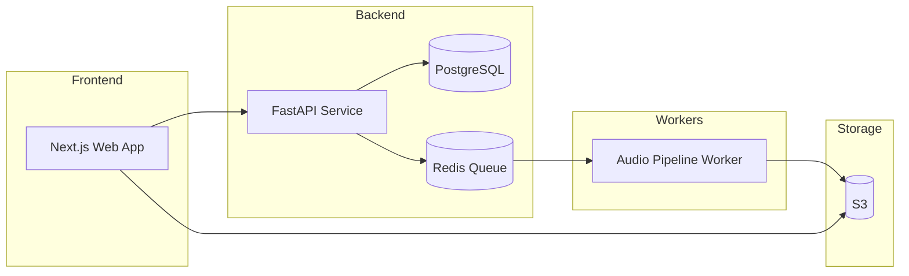

# REORCH — AI-Assisted Audio Re-Orchestration

> **Goal:** Transform a user-provided song into a new genre (e.g., ballad → rock) through **analysis → re-orchestration → re-mix/master**, not by generating a brand-new song from scratch.
>
> **See also:** [Architecture](../knowledge/architecture.md) • [Tech Stack](../knowledge/tech-stack.md)

---

## 1) Product Summary

REORCH takes an uploaded audio track and produces a genre-transformed version while preserving the original musical identity as much as possible (melody and structure), depending on quality settings and available processing.

### Key Capabilities
- Upload audio (WAV/MP3)
- Choose target style preset (Ballad → Rock, Acoustic → Pop Punk, Pop → Jazz, etc.)
- Run transformation as a background job with progress status
- Download final output (MP3/WAV) + optional stems package

### Non-Goals (for clarity)
- Not a text-to-song generator (Phase 3)
- Not a "celebrity voice clone" tool
- Not perfect reconstruction of studio-quality stems (initially)

---

## 2) Users & Use Cases

### Primary Users
- Creators who want "alternate versions" of their songs
- Producers who want quick genre exploration
- Bands who want arrangement ideas

### Example Use Cases
- Convert piano ballad → rock anthem
- Convert acoustic singer-songwriter → pop punk
- Convert chill lo-fi → upbeat EDM

---

## 3) Quality Levels (Ship in Steps)

| Level | Features |
|-------|----------|
| **MVP** | Basic tempo analysis, EQ/compression changes, drum replacement (optional), simple harmonic enhancement. Output is "fun and recognizable," not studio-perfect. |
| **V1** | Stem separation, time-stretch alignment, rock drum synthesis/replacement, better mastering (LUFS target, limiter). |
| **V2** | Key-aware reharmonization, arrangement generation (fills, transitions), artifact reduction, multi-pass refinement. |

---

## 4) Tech Stack

| Layer | Technology |
|-------|------------|
| **Frontend** | Next.js (TypeScript), Tailwind + shadcn/ui, Web Audio API |
| **Backend** | Python FastAPI (REST), PostgreSQL, Redis (queue), S3-compatible storage |
| **Workers** | Python worker service (horizontal scaling), optional GPU nodes |
| **Processing** | FFmpeg, stem separation models |

---

## 5) System Architecture

### High-Level Data Flow
1. User uploads track → stored in S3 (original)
2. API creates a `job` in DB and enqueues to Redis
3. Worker pulls job → downloads → transforms → uploads outputs
4. Frontend polls job status and shows progress
5. User downloads outputs

---

## 6) Audio Pipeline Design

### Stages
1. **Ingest & Canonicalization** → `original_canonical.wav`
2. **Analysis** → `{bpm, key, duration}` JSON
3. **Separation** (V1+) → stems WAVs
4. **Re-Orchestration** → genre-specific processing
5. **Mix & Master** → final WAV/MP3

### Ballad → Rock Preset Changes
- **Drums:** stronger transients, rock kit, fills
- **Bass:** tighter low-end, saturation
- **Guitars:** distortion/harmonic excitation
- **Dynamics:** aggressive compression
- **EQ:** remove mud, boost presence

---

## 7) Job States & Progress

| State | Description |
|-------|-------------|
| `queued` | Waiting for worker |
| `running` | Processing in progress |
| `succeeded` | Complete, outputs ready |
| `failed` | Error with details |
| `canceled` | User-aborted |

### Progress Checkpoints
- `ingest` (0–10%) → `analysis` (10–25%) → `separation` (25–60%) → `reorch` (60–85%) → `master` (85–95%) → `finalize` (95–100%)

---

## 8) Database Schema (Draft)

| Table | Key Columns |
|-------|-------------|
| `users` | id, email, created_at |
| `projects` | id, user_id, title |
| `tracks` | id, project_id, original_s3_key, canonical_s3_key, duration |
| `jobs` | id, track_id, preset, status, progress, error_code |
| `outputs` | id, job_id, file_type, s3_key |
| `credits` | user_id, balance |

---

## 9) API Endpoints (Draft)

| Endpoint | Purpose |
|----------|---------|
| `POST /v1/projects` | Create project |
| `POST /v1/projects/:id/tracks` | Get signed upload URL |
| `POST /v1/tracks/:id/jobs` | Start re-orchestration job |
| `GET /v1/jobs/:id` | Poll job status |
| `GET /v1/jobs/:id/outputs` | Get download URLs |

---

## 10) Milestones

| Phase | Timeline | Deliverable |
|-------|----------|-------------|
| **MVP** | 2–4 weeks | Upload + job system + FFmpeg chain, one preset (Ballad → Rock), download output |
| **V1** | 4–8 weeks | Stem separation, better drums/bass, mastering, basic credits |
| **V2** | 8–12+ weeks | Multi-preset library, structure detection, refinement pass, stem export |

---

## 11) Known Risks & Mitigation

| Risk | Mitigation |
|------|------------|
| Artifacts from separation | Fallback mode, quality settings |
| Phase issues | Mid/side aware processing |
| Cost of separation models | Queue limits, credits |
| Legal/UX | User rights confirmation, avoid celebrity claims |
